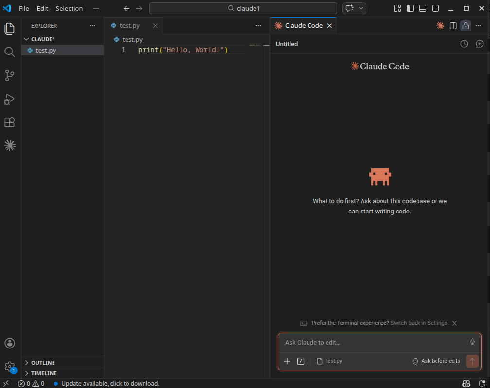
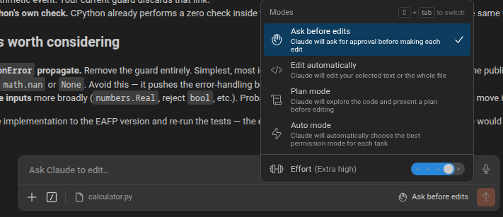
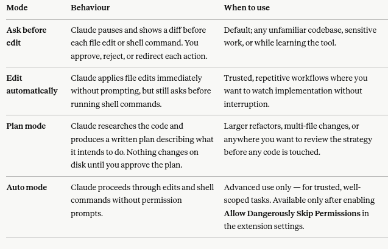

# Lab 6-1: Installing and Using Claude Code in VS Code on Ubuntu

## Overview

**_Note:  Depending on the setup that has been provided to you, Claude Code may already be installed. If you see the Spark icon in VS Code, you can skip to Part 3_**

In this lab, you will install Claude Code, Anthropic's AI coding assistant, and integrate it with VS Code on Ubuntu Linux. By the end you will have a working AI pair-programmer that can read your project, propose changes as inline diffs, and run commands with your approval.

**Estimated time:** 30–45 minutes
**Difficulty:** Beginner

---

## Learning Objectives

By the end of this lab, you will be able to:

1. Install Claude Code on Ubuntu using the native installer.
2. Install and authenticate the Claude Code extension in VS Code.
3. Configure a project with a `CLAUDE.md` file to provide standing context.
4. Use the three permission modes (Normal, Plan, Auto-accept) appropriately.
5. Issue prompts that reference specific files and line ranges.

---


## Part 1: Install Claude Code 

### Step 1.1: Open a terminal

Press `Ctrl+Alt+T` to open a terminal window.

### Step 1.2: Run the native installer

Paste the following command and press Enter:

```bash
curl -fsSL https://claude.ai/install.sh | bash
```

The installer will download and place the `claude` binary on your system. It auto-updates in the background going forward, so you will not need to re-run this.

```bash
$ curl -fsSL https://claude.ai/install.sh | bash

✔ Claude Code successfully installed!
  Version: 2.1.143
  Location: ~/.local/bin/claude
  Next: Run claude --help to get started
```

### Step 1.3: Verify the installation

Close and reopen your terminal, then run:

```bash
$  claude --version
2.1.143 (Claude Code)
```

**Expected output:** a version number such as `claude-code 2.x.x`.

> **Troubleshooting:** If the command is not found, your `PATH` may not yet include the install location. Try `source ~/.bashrc` (or `~/.zshrc` if you use Zsh) and retry.

### Step 1.4: Authenticate

Run:

```bash
claude
```

You will be prompted to log in. Follow the link displayed in the terminal, sign in to your Claude account in the browser, and authorize the CLI. When you return to the terminal, you should see a Claude Code prompt.

```console
$ claude
╭─── Claude Code v2.1.143 ────────────────────────────────────────────────────────────────────────────────────────────────────────────────────────────────────────────────────────────╮
│                                                    │ Tips for getting started                                                                                                       │
│                  Welcome back Rod!                 │ Run /init to create a CLAUDE.md file with instructions for Claude                                                              │
│                                                    │ ────────────────────────────────────────────────────────────────────────────────────────────────────────────────────────────── │
│                       ▐▛███▜▌                      │ What's new                                                                                                                     │
│                      ▝▜█████▛▘                     │ Added plugin dependency enforcement: `claude plugin disable` now refuses when another enabled plugin depends on the target (w… │
│                        ▘▘ ▝▝                       │ Added projected context cost (per-turn and per-invocation token estimates) to the `/plugin` marketplace browse pane            │
│        Opus 4.7 (1M context) · Claude Max ·        │ Added `worktree.bgIsolation: "none"` setting to let background sessions edit the working copy directly without `EnterWorktree… │
│        claude@exgnosis.ca's Organization           │ /release-notes for more                                                                                                        │
│                      ~/working                     │                                                                                                                                │
╰─────────────────────────────────────────────────────────────────────────────────────────────────────────────────────────────────────────────────────────────────────────────────────╯

───────────────────────────────────────────────────────────────────────────────────────────────────────────────────────────────────────────────────────────────────────────────────────
❯ Try "how does <filepath> work?"

```
Type `/exit` to close the session for now.

```console
 /exit 
───────────────────────────────────────────────────────────────────────────────────────────────────────────────────────────────────────────────────────────────────────────────────────
/exit                         Exit the CLI
/extra-usage                  Configure extra usage to keep working when limits are hit
/context                      Visualize current context usage as a colored grid
/claude-api                   Build, debug, and optimize Claude API / Anthropic SDK apps. Apps built with this skill should include prompt caching. Also handles migrating existing
                              Claude API code between Claude model versions (4.5 → 4.6, 4.6 → 4.7, retired-model replacements). TRIGGER when: code imports `anthropic`/`@anthropic…
/memory                       Edit Claude memory files
/ultraplan                    a few minutes · Claude Code on the web drafts a plan you can edit and approve. See https://code.claude.com/docs/en/claude-code-on-the-web
/passes                       Share a free week of Claude Code with friends and earn extra usage
/clear                        Start a new session with empty context; previous session stays on disk (resumable with /resume)
/compact                      Free up context by summarizing the conversation so far
/model                        Set the AI model for Claude Code (currently Opus 4.7 (1M context))

```

---

## Part 2: Install the VS Code Extension 

### Step 2.1: Open the Extensions view in VS Code

Launch VS Code and press `Ctrl+Shift+X` to open the Extensions panel.

### Step 2.2: Search and install

In the search box, type:

```
Claude Code
```

Look for the extension published by **Anthropic** (verified publisher). Click **Install**.

> If the extension fails to install, confirm your workspace is not in **Restricted Mode**. Open the Command Palette (`Ctrl+Shift+P`) and run "Workspaces: Manage Workspace Trust" to set the workspace to trusted.

### Step 2.3: Reload and locate the Spark icon

If the extension does not appear active after installation, open the Command Palette (`Ctrl+Shift+P`) and run **Developer: Reload Window**.

Open any code file (not just a folder, a file must be active). The **Spark icon** ✨ should now appear in three places:

- The Editor Toolbar (top-right of the open file)
- The Activity Bar (left sidebar)
- The Status Bar (bottom-right)

### Step 2.4: Sign in from the extension

Click the Spark icon. The extension panel opens. You should already be signed in from Part 1; if not, click **Claude.ai Subscription** and follow the browser prompt to authorize.

**Checkpoint:** The extension panel should show a prompt input box at the bottom and indicate you are signed in. If you see issues, run **Developer: Reload Window** again.


---

Close vs Code for now (`Ctrl+Q`) to prepare for the next part, where you will create a test project and use Claude Code to interact with it.

## Part 3: Configure a Test Project (10 minutes)

### Step 3.1: Create a project directory

In your terminal:

```bash
mkdir ~/claude-lab
cd ~/claude-lab
code .
```

This opens the empty directory in VS Code.

### Step 3.2; Create a simple starter file

Inside VS Code, create a new file called `calculator.py` with the following content:

```python
def add(a, b):
    return a + b

def subtract(a, b):
    return a - b

def multiply(a, b):
    return a * b

def divide(a, b):
    return a / b
```

Save the file (`Ctrl+S`).

### Step 3.3: Generate a CLAUDE.md file

Open the Claude Code panel (click the Spark icon). In the prompt box, type:

```
/init
```

Press Enter. Claude will analyze the directory and propose a `CLAUDE.md` file with project commands, architecture notes, and conventions. Review the proposed content and accept it.

It may comment that the project is not complex enough to warrant a `claude.md`. Shoose the option to create a placeholder file that you can use later.

> **What is `CLAUDE.md`?** It is a plain-text file Claude reads at the start of every session in this project. Use it to record build commands, coding conventions, and architectural decisions so you do not have to re-explain them every time.
> 
> Recall from the slides that one of the key principles of prompt engineering is to "provide context". `CLAUDE.md` is a tool for providing persistent context across sessions.

---

## Part 4: Hands-On Exercises

### Exercise 4.1: Generate code (Default mode)

Confirm the mode selector at the bottom of the prompt box shows **Default** or the text in the prompt box says "Ask Claude to edit files" 
- Make sure that "Auto-accept mode" is not enabled (the toggle should be off) and that Claude asks for permission before each edit.
- 
In the prompt box, type:

```
Add docstrings to every function in calculator.py following PEP 257 conventions. 
Also add a guard against division by zero in divide().
```
The refactored code should look like this

```python
def add(a, b):
    """Return the sum of a and b."""
    return a + b

def subtract(a, b):
    """Return the difference of a and b (a - b)."""
    return a - b

def multiply(a, b):
    """Return the product of a and b."""
    return a * b

def divide(a, b):
    """Return the quotient of a and b (a / b).

    Raises:
        ValueError: If b is zero.
    """
    if b == 0:
        raise ValueError("Cannot divide by zero")
    return a / b
```
**Observe:**
- Claude reads `calculator.py`.
- A side-by-side diff appears.
- Click **Accept** to apply the changes, or **Reject** to discard.

**Discussion question:** What does the diff show? How does this differ from an autocomplete-style assistant?

### Exercise 4.2: Use file mentions

In the prompt box, type `@` and select `calculator.py` from the dropdown. Then add:

```
Write a pytest test suite for these functions in a new file called test_calculator.py.
 Include edge cases.
```

**Observe:** Claude creates a new file and shows you the diff before writing it to disk.

Answer "yes" to all the questions that Claude asks about permissions. Review the proposed test suite and accept it. The resulting `test_calculator.py` should look like this:

```Python
import pytest

from calculator import add, subtract, multiply, divide


class TestAdd:
    def test_positive(self):
        assert add(2, 3) == 5

    def test_negative(self):
        assert add(-2, -3) == -5

    def test_mixed_signs(self):
        assert add(-5, 3) == -2

    def test_zero(self):
        assert add(0, 0) == 0
        assert add(7, 0) == 7

    def test_floats(self):
        assert add(0.1, 0.2) == pytest.approx(0.3)


class TestSubtract:
    def test_positive(self):
        assert subtract(5, 3) == 2

    def test_negative_result(self):
        assert subtract(3, 5) == -2

    def test_zero(self):
        assert subtract(7, 7) == 0
        assert subtract(7, 0) == 7

    def test_double_negative(self):
        assert subtract(-5, -3) == -2

    def test_floats(self):
        assert subtract(1.0, 0.1) == pytest.approx(0.9)


class TestMultiply:
    def test_positive(self):
        assert multiply(3, 4) == 12

    def test_by_zero(self):
        assert multiply(0, 99) == 0
        assert multiply(99, 0) == 0

    def test_by_one(self):
        assert multiply(1, 42) == 42

    def test_negative(self):
        assert multiply(-3, 4) == -12
        assert multiply(-3, -4) == 12

    def test_floats(self):
        assert multiply(2.5, 4) == 10.0


class TestDivide:
    def test_positive(self):
        assert divide(10, 2) == 5

    def test_negative(self):
        assert divide(-10, 2) == -5
        assert divide(-10, -2) == 5

    def test_zero_numerator(self):
        assert divide(0, 5) == 0

    def test_float_result(self):
        assert divide(1, 4) == 0.25

    def test_divide_by_zero_raises(self):
        with pytest.raises(ValueError, match="Cannot divide by zero"):
            divide(5, 0)

    def test_divide_by_zero_with_zero_numerator(self):
        with pytest.raises(ValueError):
            divide(0, 0)

```

### Exercise 4.3: Reference a specific line range

Open `calculator.py` and select lines containing the `divide` function. Press `Alt+K` — this auto-inserts an `@calculator.py` reference with the exact line range into the prompt.

Add the question:

```
Explain the division-by-zero guard you added and suggest an alternative approach.
```
Review the response. Notice how Claude can read the specific lines you referenced and does not need to analyze the entire file again.


### Exercise 4.4: Try Plan mode

Enter plan mode using one of these methods:

- Keyboard shortcut: Press Shift+Tab in the prompt box to cycle through modes until the indicator shows plan.
- Select the mode from the dropdown at the bottom of the prompt box.



Issue this prompt:

```
Refactor calculator.py to use a Calculator class instead of standalone functions. Preserve all existing behaviour.
```

**Observe:** Instead of immediately producing changes, Claude opens a Markdown document describing exactly what it intends to do. You can annotate this plan with comments before approving.

**Discussion question:** When would Plan mode be more appropriate than Normal mode?

---

## Part 5: Cleanup and Reflection

### Cleanup

Switch the mode back to **Normal** before ending the session. To remove the lab project:

```bash
rm -rf ~/claude-lab
```

Your Claude credentials remain stored at `~/.claude/` and do not need to be removed.

### Reflection Questions

Answer the following in your lab notebook:

1. Compare Claude Code to GitHub Copilot. What kinds of tasks does each tool handle better? (This may require you to do a bit of research on Copilot if you are not already familiar with it.)
2. Why does Claude Code ask for permission before each edit by default? What are the trade-offs of switching to Auto-accept mode?
3. What information would you include in a `CLAUDE.md` file for a larger, multi-developer project?
4. The `@filename` syntax lets you reference files explicitly. Why is this useful when working with a large codebase?

---

## Permission Modes Reference



**Safety note: Auto mode skips the safeguards that protect you from unintended edits and shell commands.**
---

## Useful Slash Commands

| Command | Function |
|---------|----------|
| `/init` | Generate a `CLAUDE.md` for the current project |
| `/login` | Switch accounts |
| `/doctor` | Diagnose installation problems |
| `/plugins` | Manage installed plugins |
| `/exit` | End the current session |

---

## Troubleshooting

**Spark icon does not appear after installing the extension.**
Open the Command Palette and run **Developer: Reload Window**. Confirm a file is open in the editor — not just a folder.

**Authentication fails or the browser does not return.**
Delete `~/.claude/credentials.json` and run `claude` again to re-authenticate.

**The `claude` command is not found after installation.**
Run `source ~/.bashrc` (or restart your terminal) to refresh the `PATH`.

**Conflicts with other AI extensions.**
Temporarily disable other AI coding extensions (such as Cline or Continue) because they can interfere with Claude Code's IDE integration.

**Permission prompts on every shell command interrupt your workflow.**
Create a `.claude/settings.json` in your project root with an explicit allowlist. Example:

```json
{
  "permissions": {
    "allow": ["Read", "Edit", "Bash(git status)", "Bash(npm test)", "Bash(pytest)"]
  }
}
```

---

## Further Reading

- Claude Code documentation: <https://code.claude.com/docs>
- VS Code extension page: <https://marketplace.visualstudio.com/items?itemName=anthropic.claude-code>
- `CLAUDE.md` best practices: <https://code.claude.com/docs/en/memory>
