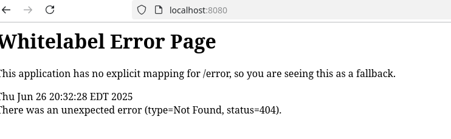

# Lab 6-1: REST

## Lab Objectives

- In this lab, you will use Spring MVC to implement a greeting Restful web service that will accept HTTP GET requests at: http://localhost:8080/greeting.
- The service returns a web page that contains the greeting “Hello, World!”
- The request can include an optional name parameter in the query string like this http://localhost:8080/greeting?name=User.
- The name parameter value overrides the default value of "World"

## Part 1: Get the starter

- Go to https://start.spring.io.
- You will be using the Spring Web starter.
- All you need is the Spring Web dependency.

- Use the screenshot to configure the project


- Download and unzip the project
- Locate to the project directory
- Start VS code 

## Part 3: Test the app

- In the VS Code terminal:
- Run `mvn validate`
- Run `mvn package` to build the app
- Start the app as a Java application

```console

  .   ____          _            __ _ _
 /\\ / ___'_ __ _ _(_)_ __  __ _ \ \ \ \
( ( )\___ | '_ | '_| | '_ \/ _` | \ \ \ \
 \\/  ___)| |_)| | | | | || (_| |  ) ) ) )
  '  |____| .__|_| |_|_| |_\__, | / / / /
 =========|_|==============|___/=/_/_/_/

 :: Spring Boot ::                (v3.5.3)

2025-06-26T20:32:09.743-04:00  INFO 3953152 --- [MVC] [           main] com.example.MVC.MvcApplication           : Starting MvcApplication using Java 21.0.6 with PID 3953152 (/home/rod/lab8-1/MVC/target/classes started by rod in /home/rod/lab8-1/MVC)
2025-06-26T20:32:09.745-04:00  INFO 3953152 --- [MVC] [           main] com.example.MVC.MvcApplication           : No active profile set, falling back to 1 default profile: "default"
2025-06-26T20:32:10.159-04:00  INFO 3953152 --- [MVC] [           main] o.s.b.w.embedded.tomcat.TomcatWebServer  : Tomcat initialized with port 8080 (http)
2025-06-26T20:32:10.167-04:00  INFO 3953152 --- [MVC] [           main] o.apache.catalina.core.StandardService   : Starting service [Tomcat]
2025-06-26T20:32:10.168-04:00  INFO 3953152 --- [MVC] [           main] o.apache.catalina.core.StandardEngine    : Starting Servlet engine: [Apache Tomcat/10.1.42]
2025-06-26T20:32:10.196-04:00  INFO 3953152 --- [MVC] [           main] o.a.c.c.C.[Tomcat].[localhost].[/]       : Initializing Spring embedded WebApplicationContext
2025-06-26T20:32:10.197-04:00  INFO 3953152 --- [MVC] [           main] w.s.c.ServletWebServerApplicationContext : Root WebApplicationContext: initialization completed in 425 ms
2025-06-26T20:32:10.377-04:00  INFO 3953152 --- [MVC] [           main] o.s.b.w.embedded.tomcat.TomcatWebServer  : Tomcat started on port 8080 (http) with context path '/'
2025-06-26T20:32:10.383-04:00  INFO 3953152 --- [MVC] [           main] com.example.MVC.MvcApplication           : Started MvcApplication in 0.868 seconds (process running for 1.03)
2025-06-26T20:32:28.617-04:00  INFO 3953152 --- [MVC] [nio-8080-exec-1] o.a.c.c.C.[Tomcat].[localhost].[/]       : Initializing Spring DispatcherServlet 'dispatcherServlet'
2025-06-26T20:32:28.617-04:00  INFO 3953152 --- [MVC] [nio-8080-exec-1] o.s.web.servlet.DispatcherServlet        : Initializing Servlet 'dispatcherServlet'
2025-06-26T20:32:28.618-04:00  INFO 3953152 --- [MVC] [nio-8080-exec-1] o.s.web.servlet.DispatcherServlet        : Completed initialization in 1 ms
```

- The application is now running.
- However, it doesn't do anything yet so when you go `localhost:8080`, you see the default `404` white label page



- Shut down the application by hitting control-C in the VS Code terminal.

## Part 3: Create the Model Class

- The resources that are being referenced by the web service are `Greeting` entities.
- These are Pojos that need to know nothing about the controller or the views that are being used.
- Notice that each resource created will have an id, a convention that is consistent with the REST approach
- Make the Greeting class in the MVC package


```java
package com.example.MVC;


public class Greeting {
	private final long id;
	private final String content;
	
	public long getId() {
		return id;
	}

	public String getContent() {
		return content;
	}

	public Greeting(long id, String content) {
		this.id = id;
		this.content = content;
	}

}
```

## Part 4: REST Controller

- The `@RestController` annotation tells Spring that this class is the controller.
- The view object is normally what is returned to the client.
- In this case, the view is just a string so the static String variable is our view that gets updated with a new Greeting object
- The `@GetMapping(URL`) maps specific URLs to processing objects.
- In this case, the effect is to create a new model Greeting object and populate the view (the string) with its values

```java
package com.example.MVC;

import java.util.concurrent.atomic.AtomicLong;

import org.springframework.web.bind.annotation.GetMapping;
import org.springframework.web.bind.annotation.RequestParam;
import org.springframework.web.bind.annotation.RestController;

@RestController
public class GreetingController {
    private final static String template = "Hello,%s";
    private final static AtomicLong counter = new AtomicLong();

    @GetMapping("/greeting")
    public Greeting greeting(@RequestParam(value = "name", defaultValue = "world") String name) {
        return new Greeting(counter.incrementAndGet(), String.format(template, name));
    }

    @GetMapping("/")
    public String base() {
        return "Root element";
    }
}
```

- In the VS Code terminal:
- Run `mvn validate`
- Run `mvn package` to build the app
- Start the app as a Java application

- The `@RequestParam()` annotation looks for an argument in the URL
- If there is one, the value is inserted into the string; otherwise it defaults to "World" '
- Since we are not using an HTML page, what we will see is a JSon object representing the serialized Greeting object


- Reloading the page shows that a new request in generated and a new Greeting resource created in response.


- Using a name parameter


## Part 5: Change the URL

- Shut down the server
- Change the mapping from `/greeting` to anything else, like `/howdy`
- Restart the server and test out the new URL


- Shut down the server

## End Lab
