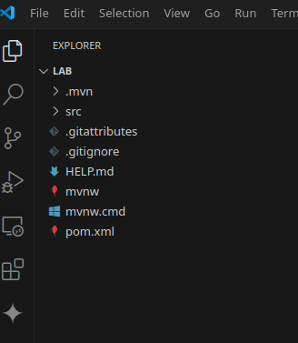

# Lab 4-1: Java JPA

## Part 1: Setup

This lab requires some initial setup.
- The Maven build tool will be used to build the application
- The Spring Boot JPA started needs to be downloaded.

### Maven

Check to see if Maven is installed on your system by executing the following.

```console
$ mvn -verson
Apache Maven 3.6.3
Maven home: /usr/share/maven
Java version: 21.0.8, vendor: Ubuntu, runtime: /usr/lib/jvm/java-21-openjdk-amd64
Default locale: en_US, platform encoding: UTF-8
OS name: "linux", version: "6.8.0-1031-azure", arch: "amd64", family: "unix"

```

### Spring Data JPA

- We are going to have Spring Data do all the low leveL work for us.
- Go the [Spring Initializer Page](https://start.spring.io/index.html)
- You should see the following


#### Configure

- Make sure that the following options are selected
    - Maven as the build tool
    - Java as the language
    - The version of Spring boot should be the latest version that is not a snapshot. That is the highlighted version is shown in the screenshot
    - The highest version of Java that is equal to or lower than 21, the version on the lab machine
    - Packaging is set to Jar
    - The Group is set to `data`
    - The Artifact is set to `lab`


#### Select Components

- In the `Add Dependencies` box on the top right search for and add
- `Spring Data` which will provide the ORM mapping using Hibernate
- `H2 Database` which will provide an in-memory relational database

Your final configuration should look like this:

- Download the zip file into an empty directory by selecting the `Generate` option at the bottom of the page
  - By default, a file called `lab.zip` will be downloaded into you `Downloads` directory

#### Local File Setup

- Unzip the file `lab.zip` and change to the `lab` directory'
- Start Visual Studio Code in this directory.
- You should see the following directory structure



#### Maven Plugin

- Ensure the Maven extension is installed in VS Code. If not, install it


## Part 2: Compile the project

- Open a terminal in VS code and run the command `mvn compile`
- You should see something like this:


- The compile phase downloads the dependencies and creates a fully populated project which you can see with the appearance of the `target` and other directories


## Part 3: Run the project

- Spring has done all the boilerplate code for us
- Including a generated runner class

```java
package data.lab;

import org.springframework.boot.SpringApplication;
import org.springframework.boot.autoconfigure.SpringBootApplication;

@SpringBootApplication
public class LabApplication {

	public static void main(String[] args) {
		SpringApplication.run(LabApplication.class, args);
	}

}

```

To see it working
- Open the file `LabApplication.java`
- Run the file as a Java Application
- You should see the following output
- Notice that Spring
    - Creates and uses the EntityManagerFactory for us
    - Starts and creates the connection to the database
    - Exits and cleans anything up.

```console

  .   ____          _            __ _ _
 /\\ / ___'_ __ _ _(_)_ __  __ _ \ \ \ \
( ( )\___ | '_ | '_| | '_ \/ _` | \ \ \ \
 \\/  ___)| |_)| | | | | || (_| |  ) ) ) )
  '  |____| .__|_| |_|_| |_\__, | / / / /
 =========|_|==============|___/=/_/_/_/

 :: Spring Boot ::                (v3.5.3)

2025-06-21T09:25:24.414-04:00  INFO 1305725 --- [lab] [           main] data.lab.LabApplication                  : Starting LabApplication using Java 21.0.6 with PID 1305725 (/home/rod/lab4-1/lab/target/classes started by rod in /home/rod/lab4-1/lab)
2025-06-21T09:25:24.415-04:00  INFO 1305725 --- [lab] [           main] data.lab.LabApplication                  : No active profile set, falling back to 1 default profile: "default"
2025-06-21T09:25:24.726-04:00  INFO 1305725 --- [lab] [           main] .s.d.r.c.RepositoryConfigurationDelegate : Bootstrapping Spring Data JPA repositories in DEFAULT mode.
2025-06-21T09:25:24.737-04:00  INFO 1305725 --- [lab] [           main] .s.d.r.c.RepositoryConfigurationDelegate : Finished Spring Data repository scanning in 5 ms. Found 0 JPA repository interfaces.
2025-06-21T09:25:24.882-04:00  INFO 1305725 --- [lab] [           main] com.zaxxer.hikari.HikariDataSource       : HikariPool-1 - Starting...
2025-06-21T09:25:24.968-04:00  INFO 1305725 --- [lab] [           main] com.zaxxer.hikari.pool.HikariPool        : HikariPool-1 - Added connection conn0: url=jdbc:h2:mem:5b318e19-f676-405a-b78f-3b7a42432848 user=SA
2025-06-21T09:25:24.969-04:00  INFO 1305725 --- [lab] [           main] com.zaxxer.hikari.HikariDataSource       : HikariPool-1 - Start completed.
2025-06-21T09:25:24.992-04:00  INFO 1305725 --- [lab] [           main] o.hibernate.jpa.internal.util.LogHelper  : HHH000204: Processing PersistenceUnitInfo [name: default]
2025-06-21T09:25:25.013-04:00  INFO 1305725 --- [lab] [           main] org.hibernate.Version                    : HHH000412: Hibernate ORM core version 6.6.18.Final
2025-06-21T09:25:25.029-04:00  INFO 1305725 --- [lab] [           main] o.h.c.internal.RegionFactoryInitiator    : HHH000026: Second-level cache disabled
2025-06-21T09:25:25.542-04:00  INFO 1305725 --- [lab] [           main] o.s.o.j.p.SpringPersistenceUnitInfo      : No LoadTimeWeaver setup: ignoring JPA class transformer
2025-06-21T09:25:25.576-04:00  INFO 1305725 --- [lab] [           main] org.hibernate.orm.connections.pooling    : HHH10001005: Database info:
        Database JDBC URL [Connecting through datasource 'HikariDataSource (HikariPool-1)']
        Database driver: undefined/unknown
        Database version: 2.3.232
        Autocommit mode: undefined/unknown
        Isolation level: undefined/unknown
        Minimum pool size: undefined/unknown
        Maximum pool size: undefined/unknown
2025-06-21T09:25:25.728-04:00  INFO 1305725 --- [lab] [           main] o.h.e.t.j.p.i.JtaPlatformInitiator       : HHH000489: No JTA platform available (set 'hibernate.transaction.jta.platform' to enable JTA platform integration)
2025-06-21T09:25:25.730-04:00  INFO 1305725 --- [lab] [           main] j.LocalContainerEntityManagerFactoryBean : Initialized JPA EntityManagerFactory for persistence unit 'default'
2025-06-21T09:25:25.890-04:00  INFO 1305725 --- [lab] [           main] data.lab.LabApplication                  : Started LabApplication in 1.636 seconds (process running for 1.86)
2025-06-21T09:25:25.895-04:00  INFO 1305725 --- [lab] [ionShutdownHook] j.LocalContainerEntityManagerFactoryBean : Closing JPA EntityManagerFactory for persistence unit 'default'
2025-06-21T09:25:25.897-04:00  INFO 1305725 --- [lab] [ionShutdownHook] com.zaxxer.hikari.HikariDataSource       : HikariPool-1 - Shutdown initiated...
2025-06-21T09:25:25.899-04:00  INFO 1305725 --- [lab] [ionShutdownHook] com.zaxxer.hikari.HikariDataSource       : HikariPool-1 - Shutdown completed.
```

## Part 4: Add the Entity Class

In the same directory the runner class, create the `Customer` entity class show below
- The code is in the `Customer.java` file in the Solutions folder.


```java
package data.lab;

import jakarta.persistence.Entity;
import jakarta.persistence.GeneratedValue;
import jakarta.persistence.GenerationType;
import jakarta.persistence.Id;

@Entity
public class Customer {

    @Id
    @GeneratedValue(strategy=GenerationType.AUTO)
    private Long id;
    private String firstName;
    private String lastName;

    protected Customer() {}

    public Customer(String firstName, String lastName) {
        this.firstName = firstName;
        this.lastName = lastName;
    }

    @Override
    public String toString() {
        return String.format(
                "Customer[id=%d, firstName='%s', lastName='%s']",
                id, firstName, lastName);
    }

    public Long getId() {
        return id;
    }

    public String getFirstName() {
        return firstName;
    }

    public String getLastName() {
        return lastName;
    }
}
```

## Part 5: Add the JPA Interface

- We are going to use the provided CRUDRepository interface, but we are going to add a couple of extra methods.
- Note that Spring will implement the bodies of these methods.
- In the `data.lab` package, add the following interface

```java
package data.lab;

import java.util.List;

import org.springframework.data.repository.CrudRepository;

import data.lab.Customer;

public interface CustomerRepository extends CrudRepository<Customer, Long> {

	  List<Customer> findByLastName(String lastName);
	  Customer findById(long id);
	}

```

- The `CrudRepository<Customer, Long>` declaration says that the database will have a Customer table with a primary key of type Long.
- We don't have to supply an implementation of the `findByLastName` that returns a list of Customers with a given last name.
- Spring Data will be able to figure that out for us.


## Part 5: Run with test data

- Replace the exising `LabApplication.java` file contents with the following


```java
package data.lab;

import org.springframework.boot.CommandLineRunner;
import org.springframework.context.annotation.Bean;
import org.springframework.boot.SpringApplication;
import org.springframework.boot.autoconfigure.SpringBootApplication;

@SpringBootApplication
public class LabApplication {

	@Bean
	  public CommandLineRunner demo(CustomerRepository repository) {
	    return (args) -> {
	      // save a few customers
	      repository.save(new Customer("Jack", "Bauer"));
	      repository.save(new Customer("Chloe", "O'Brian"));
	      repository.save(new Customer("Kim", "Bauer"));
	      repository.save(new Customer("David", "Palmer"));
	      repository.save(new Customer("Michelle", "Dessler"));

	      // fetch all customers
	      System.out.println("Customers found with findAll():");
	      System.out.println("-------------------------------");
	      for (Customer customer : repository.findAll()) {
	    	  System.out.println(customer.toString());
	      }
	     

	      // fetch an individual customer by ID
	      Customer customer = repository.findById(1L);
	      System.out.println("Customer found with findById(1L):");
	      System.out.println("--------------------------------");
	      System.out.println(customer.toString());
	      System.out.println("");

	      // fetch customers by last name
	      System.out.println("Customer found with findByLastName('Bauer'):");
	      System.out.println("--------------------------------------------");
	      repository.findByLastName("Bauer").forEach(bauer -> {
	    	  System.out.println(bauer.toString());
	      });
	      
	    };
	  }
	
	public static void main(String[] args) {
		SpringApplication.run(LabApplication.class, args);
	}

}

```

The code does the following.
- It defines a `CommandLineRunner` class that will execute a function `demo` as if the commands were being entered at the command line.
- `demo` takes a Lambda function to apply that contains the CLI commands
- The code is available in the file `LabApplication.java` in the Solutions directory

Run the code.
- Your output should look like this:


```console
  .   ____          _            __ _ _
 /\\ / ___'_ __ _ _(_)_ __  __ _ \ \ \ \
( ( )\___ | '_ | '_| | '_ \/ _` | \ \ \ \
 \\/  ___)| |_)| | | | | || (_| |  ) ) ) )
  '  |____| .__|_| |_|_| |_\__, | / / / /
 =========|_|==============|___/=/_/_/_/
< Initializatin code snipped>
2025-06-21T09:56:25.763-04:00  INFO 1327816 --- [lab] [           main] o.h.e.t.j.p.i.JtaPlatformInitiator       : HHH000489: No JTA platform available (set 'hibernate.transaction.jta.platform' to enable JTA platform integration)
2025-06-21T09:56:25.776-04:00  INFO 1327816 --- [lab] [           main] j.LocalContainerEntityManagerFactoryBean : Initialized JPA EntityManagerFactory for persistence unit 'default'
2025-06-21T09:56:25.980-04:00  INFO 1327816 --- [lab] [           main] data.lab.LabApplication                  : Started LabApplication in 1.555 seconds (process running for 1.717)


Customers found with findAll():
-------------------------------
Customer[id=1, firstName='Jack', lastName='Bauer']
Customer[id=2, firstName='Chloe', lastName='O'Brian']
Customer[id=3, firstName='Kim', lastName='Bauer']
Customer[id=4, firstName='David', lastName='Palmer']
Customer[id=5, firstName='Michelle', lastName='Dessler']
Customer found with findById(1L):
--------------------------------
Customer[id=1, firstName='Jack', lastName='Bauer']

Customer found with findByLastName('Bauer'):
--------------------------------------------
Customer[id=1, firstName='Jack', lastName='Bauer']
Customer[id=3, firstName='Kim', lastName='Bauer']


2025-06-21T09:56:26.103-04:00  INFO 1327816 --- [lab] [ionShutdownHook] j.LocalContainerEntityManagerFactoryBean : Closing JPA EntityManagerFactory for persistence unit 'default'
2025-06-21T09:56:26.105-04:00  INFO 1327816 --- [lab] [ionShutdownHook] com.zaxxer.hikari.HikariDataSource       : HikariPool-1 - Shutdown initiated...
2025-06-21T09:56:26.107-04:00  INFO 1327816 --- [lab] [ionShutdownHook] com.zaxxer.hikari.HikariDataSource       : HikariPool-1 - Shutdown completed.
```

## End Lab